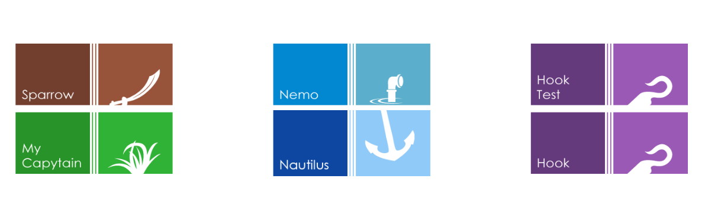
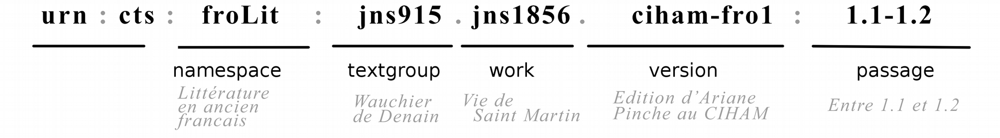
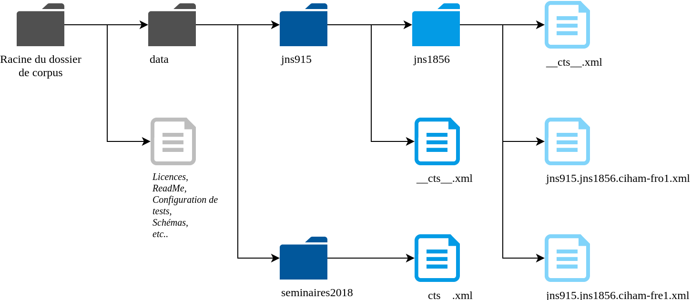

<!-- $size: 16:9 -->

<style>pre { font-size:0.65em!important; } </style>


Les outils CapiTainS, l’édition numérique et l’exploitation des textes
===

Thibault Clérice
École Nationale des Chartes / Lyon 3
thibault.clerice@chartes.psl.eu
@ponteineptique (Twitter / Github)


Slides et contenu : 
	- https://github.com/Capitains/workshop-lyon-2018

--- 

# Se connaître

Quelques questions :

- Connaissez-vous le XML ?
- Connaissez vous git ? Avez-vous un client git (graphique ou ligne de commande) ?
- Un compte github ?
- Savez-vous ce qu'est l'intégration continue ?
- Pratiquez vous un langage de programmation en dehors du monde du XML ? Python, Javascript, Php, C, etc.
  - Connaissez-vous le sens de programmation orientée objet ? Si oui, la pratiquez-vous ?
- Connaissez-vous l'XSLT ?

---

# CapiTains

## Histoire rapide

- Perseus, Perseids, (Leipzig, CHS & Tufts)
- Depuis 2015

## Aujourd'hui

- Perseus, École Nationale des Chartes, Hambourg, Alpheios, Perseids
- Principal : 6 logiciels et briques logicielles, 1 set de guidelines

---

# Capitains

CapiT(ain)S = Citable Text Services for APIs

## Objectifs

1. Rendre la mise à disposition de textes plus facile via des API Web (Interfaces web pensées pour les machines)
2. Rendre l'utilisation d'APIs web et de corpus XML plus facile pour la recherche
3. Ne pas sacrifier la liberté éditoriale

---

# Les briques principales



---

# La théorie derrière Capitains

<small>Ordered Hierarchy of Content Objects</small>


<small>TEI Consortium, « A Gentle Introduction to XML», *TEI P5 Guidelines* v3.3.0, , *http://www.tei-c.org/release/doc/tei-p5-doc/en/html/SG.html*
Allen H. Renear, Elli Mylonas et David Durand,  Refining our notion of what text really is: The problem of overlapping hierarchies », 1993, https://www.ideals.illinois.edu/handle/2142/9407.</small>

---

## Guidelines 2.0 - CTS (Depuis 2017)

- Basé pour une compatibilité avec le *Canonical Text Services* 5.0
- Spécifications particulières pour Epidoc ou TEI
- http://capitains.org/pages/guidelines.html

## Guidelines 3.0 - *DTS* (Fin 2018)

- Rétro-compatibilité proposée et transformation facilisée. 
- En cours de rédaction - https://github.com/capitains/guidelines
- Indépendant des systèmes d'identifiants, basé sur DublinCore pour les métadonnées et quelques propriétés d'une ontologie CapiTainS pour les relations "logicielles"

## Objectif général

- Les métadonnées de "catalogue" et le texte doivent être séparés pour en faciliser la maintenance
- Le système de citation du texte doit être clair et exprimé dans le texte.

---

# L'intérêt
Pour la mise à disposition et mise en valeur
- https://scaife.perseus.org/
- https://tutorial-nemo.herokuapp.com/
- https://tutorial-nemo.herokuapp.com/api/cts?request=GetPassagePlus&urn=urn:cts:latinLit:phi1103.phi001.lascivaroma-lat1:1
- http://texts.alpheios.net/text/urn:cts:latinLit:phi0959.phi006.alpheios-text-lat1/passage/1.1-1.183/classical-latin-ovid-metamorphoses-alpheios-enhanced-metamorphoses
- http://texts.alpheios.net/api/dts/ && http://texts.alpheios.net/api/dts/collections?id=urn:perseus:latinLit

Pour la recherche sur texte
- M. Romanello, Sunoikisis DC, https://github.com/mromanello/SunoikisisDC_NER/blob/master/Sunoikisis%20-%20Named%20Entity%20Extraction%201b.ipynb
---

# Guidelines 2.0 : les identifiants CTS

*Élément central des guidelines*



- **namespace**: un espace de nom défini, lié à un projet, une institution ou un cadre plus large (froLit, latinLit, greekLit, etc.)
- **textgroup**: un auteur, un groupe de textes faisant sens ensemble
- **work**: une oeuvre conceptuelle
- **version**: une incarnation de l'oeuvre 
- **passage**: une sous-partie

*Exemple : urn:cts:ahn:seminaires2018.capitains15.slides*

---

# Guidelines 2.0 : structure des dossiers




---

# Guidelines 2.0 : la TEI (en mode Epidoc)

- En TEI non Epidoc, `xml:lang` et `n` seraient sur `<body @n @xml:lang/>` ou `<text @xml:base @n/>`
```xml
<TEI xmlns="http://www.tei-c.org/ns/1.0">
 <teiHeader>
  <encodingDesc>
   <refsDecl n="CTS">
    <cRefPattern matchPattern="(\w+).(\w+)" n="vers" 
     replacementPattern="#xpath(/tei:TEI/tei:text/tei:body/tei:div/tei:div[@n='$1']/tei:l[@n='$2'])"
     />
    <cRefPattern matchPattern="(\w+)" n="poeme" 
     replacementPattern="#xpath(/tei:TEI/tei:text/tei:body/tei:div/tei:div[@n='$1'])"/>
   </refsDecl>
  </encodingDesc>
 </teiHeader>
 <text>
  <body>
   <div type="edition OR translation OR commentary" 
      xml:lang="fre" n="urn:cts:ahn:seminaires2018.capitains15-poeme.ahn">
     <div type="textpart" subtype="book" n="1"><l n="1">Lorem ipsum</l></div>
   </div>
  </body>
 </text>
</TEI>
```
---

# Guidelines 2.0 : la TEI et sa structure

```xml
<TEI xmlns="http://www.tei-c.org/ns/1.0">
 <!-- ... -->
 <text>
  <body>
   <div type="edition" 
      xml:lang="fre" n="urn:cts:ahn:seminaires2018.capitains15-poeme.ahn">
     <div type="textpart" subtype="book" n="1">
     	<l n="1">Lorem ipsum</l>
     	<l n="2">ipsum lorem</l>
     </div>
     <div type="textpart" subtype="book" n="2">
     	<l n="1">Sed consequat </l>
     	<l n="1a">urna non felis dictum</l>
     	<l n="2">non tincidunt nibh sagittis</l>
     </div>
   </div>
  </body>
 </text>
</TEI>
```
---

# Guidelines 2.0 : la TEI et son système de citation

- XPath 1 car seul complètement couvert dans tous les languages (dérivés de C, Java, javascript, etc.)
	- XPath 2 publié en janvier 2007, première implémentation en C en 2017 par Saxon
	- Toujours rien en dehors de C Saxon et d'un *wrapper* PhP
```xml
<TEI xmlns="http://www.tei-c.org/ns/1.0">
 <teiHeader>
  <encodingDesc>
   <refsDecl n="CTS">
    <cRefPattern matchPattern="(\w+).(\w+)" n="vers" 
     replacementPattern="#xpath(/tei:TEI/tei:text/tei:body/tei:div/tei:div[@n='$1']/tei:l[@n='$2'])"
     />
    <cRefPattern matchPattern="(\w+)" n="poeme" 
     replacementPattern="#xpath(/tei:TEI/tei:text/tei:body/tei:div/tei:div[@n='$1'])"/>
   </refsDecl>
  </encodingDesc>
 </teiHeader>
 <!-- ... --->
</TEI>
```

---

# Phase 1 d'exercice

## De nuptiis Philologiae et Mercurii

- `fichiers-travail/De nuptiis Philologiae et Mercurii.xml`
- Identifiant : `urn:cts:latinLit:stoa0192a.stoa001.digilibLT-lat1`

--- 

# Les fichiers de métadonnées `__cts__.xml`

## Textgroup

```xml
<textgroup xmlns="http://chs.harvard.edu/xmlns/cts" urn="URN jusqu'au *textgroup*">
    <groupname xml:lang="Langue d'expression du nom">Nom d'auteur ou de groupe</groupname>
</textgroup>
```

--- 

# Les fichiers de métadonnées `__cts__.xml`

## Work

```xml
<work 
  xmlns="http://chs.harvard.edu/xmlns/cts" 
  groupUrn="URN jusqu'au *textgroup*"
  urn="URN jusqu'au *work*"
  xml:lang="Langue principale du texte">
    <title xml:lang="Langue d'expression du titre de l'oeuvre conceptuelle">Titre</title>
    
    <edition 
       urn="URN Complète"
       xml:lang="lat"
       workUrn="URN Work">
        <label xml:lang="Langue d'expression du label">Titre de l'édition</label>
        <description xml:lang="Langue d'expression de la description">
          Description de l'édition
        </description>
    </edition>
</work>
```

--- 

# Métadonnées avancées

## Work

```xml
<work 
  groupUrn="urn:cts:latinLit:phi1103" urn="urn:cts:latinLit:phi1103.phi001" xml:lang="lat"
  xmlns:cpt="http://purl.org/capitains/ns/1.0#" xmlns="http://chs.harvard.edu/xmlns/cts"
  xmlns:dct="http://purl.org/dc/terms/" xmlns:dc="http://purl.org/dc/elements/1.1/">
    <title xml:lang="lat">Priapeia</title>
    <title xml:lang="fre">Priapées</title>
    
    <edition 
      urn="urn:cts:latinLit:phi1103.phi001.lascivaroma-lat1" 
      xml:lang="lat" workUrn="urn:cts:latinLit:phi1103.phi001">
        <label xml:lang="eng">Priapeia from Poeta Latini minores</label>
        <description xml:lang="unk">Poeta Latini minores, ed. Aemilius Baehrens, 
        Leipzig, Teubner, 1879</description>
        <cpt:structured-metadata>
            <dct:source>https://archive.org/details/poetaelatinimino12baeh2</dct:source>
            <dct:contributor >Thibault Clérice</dct:contributor>
            <dc:language >lat</dc:language>
            <dct:contributor >Aemilius Baehrens</dct:contributor>
            <dc:format >text/xml</dc:format>
            <dc:date>1879</dc:date>
            <dc:author>Anonymous</dc:author>
        </cpt:structured-metadata>
    </edition>
</work>
```

---

# Phase 2 d'exercice

À partir du fichier précédent, réaliser les fichiers de métadonnées puis les mettre dans la structure de dossier évoquée précédemment.

Lien utile pour les squelettes : 
- http://capitains.org/pages/guidelines
- (Si vous aviez des questions plus tard, en francais ou en anglais) https://github.com/Capitains/Capitains.github.io/issues


---

# Tester ses textes et métadonnées

- Pas de schémas CapiTainS pour les guidelines 2.0
	- Impossible de faire des schémas pour certaines propriétés (à notre connaissance) : calcul des passages principalement mais aussi liaison des métadonnées inter-fichiers
- On utilise alors la suite HookTest
	- Un outil en ligne de commande 
		- https://github.com/capitains/Hooktest 
		- `pip install hooktest` avec python3
		- `hooktest --help`
   - Un outil en ligne : https://capitains-validator.herokuapp.com/

---

# Aller plus loin : l'intégration continue

**Principe:** L'intégration continue sert entre autres à lancer une batterie de tests développés par l'équipe de développement ou à compiler des logiciels à chaque modification sur un serveur centralisé.

**Pratique:** 
- Création d'un repository *git* sur GitHub ( http://github.com )
- Connexion du repository sur TravisCI ( http://travis-ci.org/ )
- Configuration du fichier `.travis.yml`

---

# Un script travis Hooktest basique

```yml
filter_secrets: false
language: python
python:
  - "3.5"

install:
  - pip install -r requirements.txt
  - pip3 install HookTest>=1.0.0

script:
  - hooktest ./ --scheme tei --workers 3 --verbose 10 --console table --countword --allowfailure

```

---

# Un apercu de la prochaine séance

- http://tutorial-nemo.herokuapp.com/

---
# Question - Discussion

- Votre situation et Capitains ?
- 
