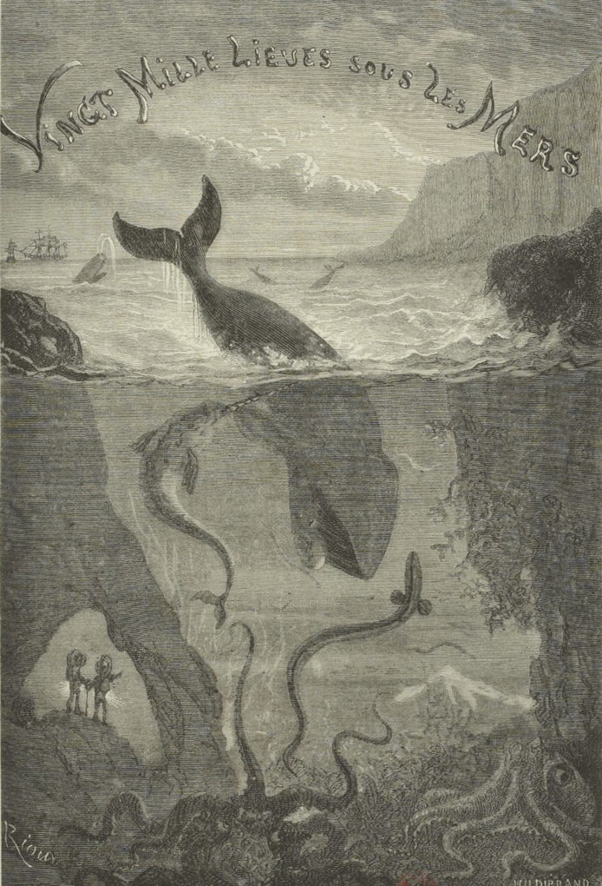
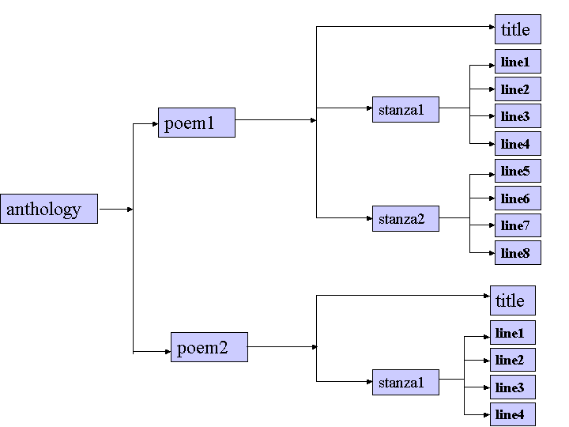

<!-- $size: 16:9 -->

<style>pre { font-size:0.65em!important; } </style>



Les outils CapiTainS, l’édition numérique et l’exploitation des textes
===

Thibault Clérice
École Nationale des Chartes / Lyon 3
thibault.clerice@chartes.psl.eu
@ponteineptique (Twitter / Github)

---

# CapiTains

## Histoire rapide

- Perseus, Perseids, (Leipzig, CHS & Tufts)
- Depuis 2015

## Aujourd'hui

- Perseus, École Nationale des Chartes, Hambourg, Alpheios, Perseids
- Principal : 6 logiciels et briques logicielles, 1 set de guidelines

---

# Capitains

CapiT(ain)S = Citable Text Services for APIs

## Objectifs

1. Rendre la mise à disposition de textes plus facile via des API Web (Interfaces web pensées pour les machines)
2. Rendre l'utilisation d'APIs web et de corpus XML plus facile pour la recherche
3. Ne pas sacrifier la liberté éditoriale

---

# La théorie derrière Capitains

<small>Ordered Hierarchy of Content Objects</small>




<small>TEI Consortium, « A Gentle Introduction to XML», *TEI P5 Guidelines* v3.3.0, , *http://www.tei-c.org/release/doc/tei-p5-doc/en/html/SG.html*
Allen H. Renear, Elli Mylonas et David Durand,  Refining our notion of what text really is: The problem of overlapping hierarchies », 1993, https://www.ideals.illinois.edu/handle/2142/9407.</small>

---

## Guidelines 2.0 - CTS (Depuis 2017)

- Basé pour une compatibilité avec le *Canonical Text Services* 5.0
- Spécifications particulières pour Epidoc ou TEI

## Guidelines 3.0 - *DTS* (Fin 2018)

- Rétro-compatibilité proposée et transformation facilisée. 
- En cours de rédaction - https://github.com/capitains/guidelines
- Indépendant des systèmes d'identifiants, basé sur DublinCore pour les métadonnées et quelques propriétés d'une ontologie CapiTainS pour les relations "logicielles"

## Objectif général

- Les métadonnées de "catalogue" et le texte doivent être séparés pour en faciliser la maintenance
- Le système de citation du texte doit être clair et exprimé dans le texte.

---

# Guidelines 2.0 : les identifiants CTS

*Élément central des guidelines*


- **namespace**: un espace de nom défini, lié à un projet, une institution ou un cadre plus large (froLit, latinLit, greekLit, etc.)
- **textgroup**: un auteur, un groupe de textes faisant sens ensemble
- **work**: une oeuvre conceptuelle
- **version**: une incarnation de l'oeuvre 
- **passage**: une sous-partie

*Exemple : urn:cts:ahn:seminaires2018.capitains15.slides*

---

# Guidelines 2.0 : structure des dossiers


---

# Guidelines 2.0 : la TEI (en mode Epidoc)

```xml
<TEI xmlns="http://www.tei-c.org/ns/1.0">
 <teiHeader>
  <encodingDesc>
   <refsDecl n="CTS">
    <cRefPattern matchPattern="(\w+).(\w+)" n="vers" 
     replacementPattern="#xpath(/tei:TEI/tei:text/tei:body/tei:div/tei:div[@n='$1']/tei:l[@n='$2'])"
     />
    <cRefPattern matchPattern="(\w+)" n="poeme" 
     replacementPattern="#xpath(/tei:TEI/tei:text/tei:body/tei:div/tei:div[@n='$1'])"/>
   </refsDecl>
  </encodingDesc>
 </teiHeader>
 <text>
  <body>
   <div type="edition OR translation OR commentary" 
      xml:lang="fre" n="urn:cts:ahn:seminaires2018.capitains15-poeme.ahn">
     <div type="textpart" subtype="book" n="1"><l n="1">Lorem ipsum</l></div>
   </div>
  </body>
 </text>
</TEI>
```
---

# Guidelines 2.0 : la TEI et sa structure

```xml
<TEI xmlns="http://www.tei-c.org/ns/1.0">
 <!-- ... -->
 <text>
  <body>
   <div type="edition" 
      xml:lang="fre" n="urn:cts:ahn:seminaires2018.capitains15-poeme.ahn">
     <div type="textpart" subtype="book" n="1">
     	<l n="1">Lorem ipsum</l>
     	<l n="2">ipsum lorem</l>
     </div>
     <div type="textpart" subtype="book" n="2">
     	<l n="1">Sed consequat </l>
     	<l n="1a">urna non felis dictum</l>
     	<l n="2">non tincidunt nibh sagittis</l>
     </div>
   </div>
  </body>
 </text>
</TEI>
```
---

# Guidelines 2.0 : la TEI et son système de citation

- XPath 1 car seul complètement couvert dans tous les languages (dérivés de C, Java, javascript, etc.)
	- XPath 2 publié en janvier 2007, première implémentation en C en 2017 par Saxon
	- Toujours rien en dehors de C Saxon et d'un *wrapper* PhP
```xml
<TEI xmlns="http://www.tei-c.org/ns/1.0">
 <teiHeader>
  <encodingDesc>
   <refsDecl n="CTS">
    <cRefPattern matchPattern="(\w+).(\w+)" n="vers" 
     replacementPattern="#xpath(/tei:TEI/tei:text/tei:body/tei:div/tei:div[@n='$1']/tei:l[@n='$2'])"
     />
    <cRefPattern matchPattern="(\w+)" n="poeme" 
     replacementPattern="#xpath(/tei:TEI/tei:text/tei:body/tei:div/tei:div[@n='$1'])"/>
   </refsDecl>
  </encodingDesc>
 </teiHeader>
 <!-- ... --->
</TEI>
```

